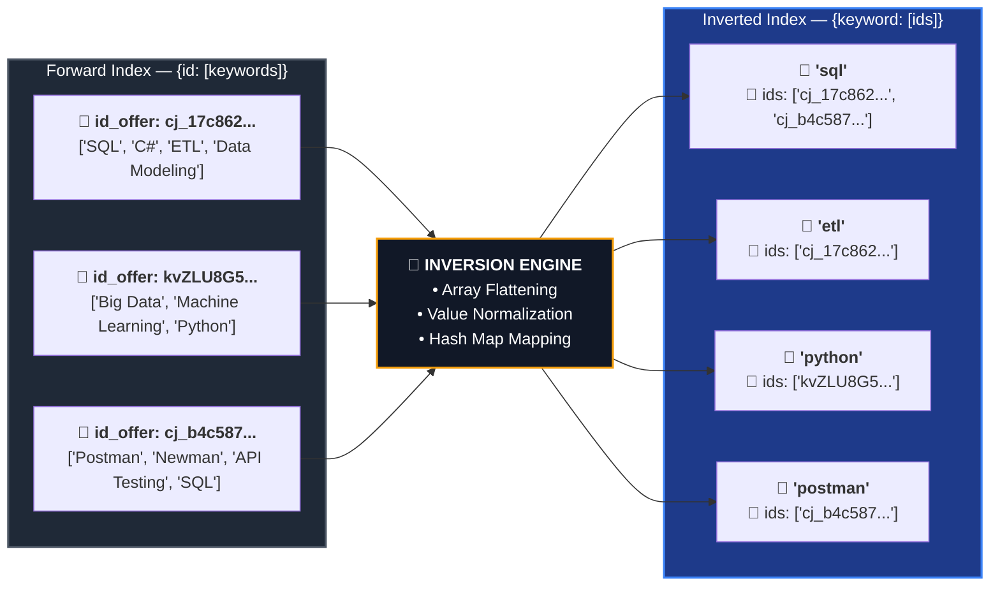

## Streamlit Cloud DashBoard  powered by AI

### Fecthing data from Gold Schema

```mermaid
graph TD
    %% Source Database (Gold / Serving Layer)
    subgraph source_table ["Source Table: serving.job_offer"]
        style source_table fill:#1f2937,stroke:#4b5563,stroke-width:2px,color:#fff
        
        id_offer[(id_offer)]
        basic_info["Job Information<br/>(api_source, job_title, contract_type, etc.)"]
        ai_metrics["AI Evaluations<br/>(score_relevancy, explanation)"]
        company_info["Company Profile<br/>(company_name, website, type)"]
        geo_data["Geolocation<br/>(city, country, lat, lon)"]
        meta_data["Traceability<br/>(offer_url, dates)"]
        
        %% Explicit Exclusion Box for Privacy
        exclusion_rule["⚠️ Privacy Security:<br/>Emails are NOT transferred"]
        style exclusion_rule fill:#7f1d1d,stroke:#ef4444,stroke-width:1px,color:#fff
        
        %% Skills arrays block
        subgraph skills_arrays ["The 5 Raw Skills Arrays"]
            style skills_arrays fill:#374151,stroke:#9ca3af,stroke-width:1px
            skills_lang[skills_languages]
            skills_fw[skills_frameworks]
            skills_apt[skills_aptitudes]
            skills_soft[skills_soft]
            alt_titles[alternative_job_titles]
        end
    end

    %% Keywords Pipeline Processing
    subgraph sql_pipeline ["all_keywords Fusion & Cleansing"]
        style sql_pipeline fill:#111827,stroke:#f59e0b,stroke-width:2px,color:#fff
        
        skills_lang & skills_fw & skills_apt & skills_soft & alt_titles --> Step1
        
        Step1["1. Sanitization (COALESCE + JSONB Conversion)"] --> Step2
        Step2["2. Merge 5 Lists (|| Operator)"] --> Step3
        Step3["3. Flattening (jsonb_array_elements_text)"] --> Step4
        Step4["4. Deduplication (DISTINCT)"] --> Step5
        Step5["5. Final Aggregation (jsonb_agg)"]
    end

    %% Final Dataset Output for Streamlit Front-End
    subgraph final_dataset ["Final Dataset for Streamlit"]
        style final_dataset fill:#1e3a8a,stroke:#3b82f6,stroke-width:2px,color:#fff
        
        O_id[job_id]
        O_basic[Job Info]
        O_ai[Filters & AI Justification]
        O_comp[Company Profile]
        O_geo[Map Data]
        O_meta[Metadata]
        
        %% Highlighted Final Consolidated Target Field
        O_kw[["all_keywords (Unique Merged List)"]]
    end

    %% Direct Structural Mapping
    id_offer --> O_id
    basic_info --> O_basic
    ai_metrics --> O_ai
    company_info --> O_comp
    geo_data --> O_geo
    meta_data --> O_meta
    
    %% Pipeline connection to the final serving field
    Step5 --> O_kw
```

* ### Inverted Indexing for Efficient Keyword Retrieval
Keywords extracted by the LLM during the enrichment phase (Silver layer) are consolidated into a single inverted index. By applying fuzzy matching techniques **during the index-building phase**, synonymous or poorly formatted terms are normalized into unified, unique keys.

Each unique keyword token points directly to a list of corresponding `job_id`s. 

Instead of executing a linear scan, looping through every single job offer to evaluate its nested arrays (a process scaling at $O(N)$ complexity), the Streamlit application performs a direct hash map lookup. Because the fuzzy matching and tokenization are entirely pre-computed, retrieving the matching job offers for any given keyword occurs in near-instantaneous $O(1)$ time complexity. These keywords allow us to completely abstract looping through dense job description in the context of the dashboard.

* ### Location and Language Standardization
The pipeline utilizes geospatial mapping libraries to standardize messy geographical inputs. By taking raw location strings or coordinates (`latitude`, `longitude`), it runs a reverse-geocoding process to resolve and unify city and country names. This eliminates duplicates caused by spelling variations.

* ### Company Metadata Enrichment
To ensure data consistency across the serving layer, company information is cleaned and structured into distinct, high-value fields via Google Maps API: the verified company name, official website URL, and primary industry vertical. 

* ### LLM-Driven Categorization
Highly variable attributes, such as `contract_type` and `seniority`, are classified into strict, pre-defined taxonomies by the LLM during ingestion, transforming unstructured job descriptions into predictable filtering facets.

* ### System Architecture Efficiency
By decoupling the LLM processing from the runtime querying interface, the LLM never needs to scan or hold the entire dataset in memory. It simply acts as a structured metadata extractor during ingestion. Thanks to this combination of pre-computed indexing, data standardization, and hash-based lookups, the front-end application remains highly scalable, performant, and cost-effective. The LLM does not even know the structure of the datas themselves with only 2 inexpensives case.

### Keywords — Keys inversion
