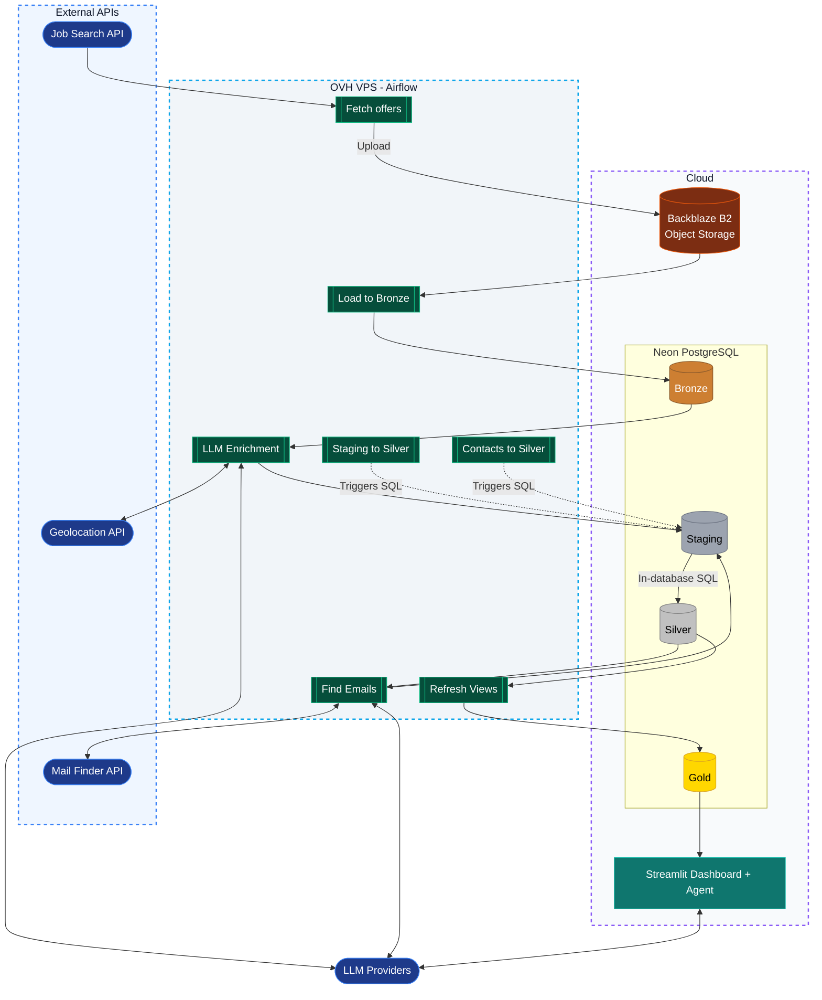

## Pipeline complete

```mermaid
graph TB
    subgraph APIs [External APIs]
        direction TB
        ExtAPI([Job Search API])
        GeoAPI([Geolocation API])
        MailFinderAPI([Mail Finder API])
    end

    LLM([LLM Providers])

    subgraph VPS [OVH VPS - Airflow]
        direction TB
        Fetch[[Fetch offers]]
        LoadBronze[[Load to Bronze]]
        Enrich[[LLM Enrichment]]
        ToSilver[[Staging to Silver]]
        Views[[Refresh Views]]
        Mails[[Find Emails]]
        ToContacts[[Contacts to Silver]]
    end

    subgraph Cloud [Cloud]
        direction TB
        B2[(Backblaze B2<br/>Object Storage)]

        subgraph DB [Neon PostgreSQL]
            direction TB
            Bronze[(Bronze)]
            Staging[(Staging)]
            Silver[(Silver)]
            Gold[(Gold)]
        end

        Dashboard[Streamlit Dashboard + Agent]
    end

    ExtAPI --> Fetch
    Fetch -->|Upload| B2
    B2 --> LoadBronze
    LoadBronze --> Bronze

    Bronze --> Enrich
    Enrich <--> LLM
    Enrich <--> GeoAPI
    Enrich --> Staging

    ToSilver -.->|Triggers SQL| Staging
    Staging -->|In-database SQL| Silver

    Silver --> Views
    Views --> Gold

    Silver --> Mails
    Mails <--> LLM
    Mails <--> MailFinderAPI
    Mails --> Staging
    ToContacts -.->|Triggers SQL| Staging

    Gold --> Dashboard
    Dashboard <--> LLM

    classDef external fill:#1e3a8a,stroke:#3b82f6,color:#fff;
    classDef airflow_task fill:#064e3b,stroke:#10b981,color:#fff;
    classDef cloud_app fill:#0f766e,stroke:#14b8a6,color:#fff;
    classDef api_env fill:#eff6ff,stroke:#3b82f6,stroke-width:2px,stroke-dasharray: 5 5,color:#0f172a;
    classDef vps_env fill:#f1f5f9,stroke:#0ea5e9,stroke-width:2px,stroke-dasharray: 5 5,color:#0f172a;
    classDef cloud_env fill:#f8fafc,stroke:#8b5cf6,stroke-width:2px,stroke-dasharray: 5 5,color:#0f172a;
    classDef bucket fill:#7c2d12,stroke:#ea580c,color:#fff;
    classDef bronze fill:#cd7f32,stroke:#8b5a2b,color:#fff;
    classDef staging fill:#9ca3af,stroke:#6b7280,color:#000;
    classDef silver fill:#c0c0c0,stroke:#808080,color:#000;
    classDef gold fill:#ffd700,stroke:#daa520,color:#000;

    class ExtAPI,LLM,GeoAPI,MailFinderAPI external;
    class Fetch,LoadBronze,Enrich,ToSilver,Views,Mails,ToContacts airflow_task;
    class Dashboard cloud_app;
    class APIs api_env;
    class VPS vps_env;
    class Cloud cloud_env;
    class B2 bucket;
    class Bronze bronze;
    class Staging staging;
    class Silver silver;
    class Gold gold;
```