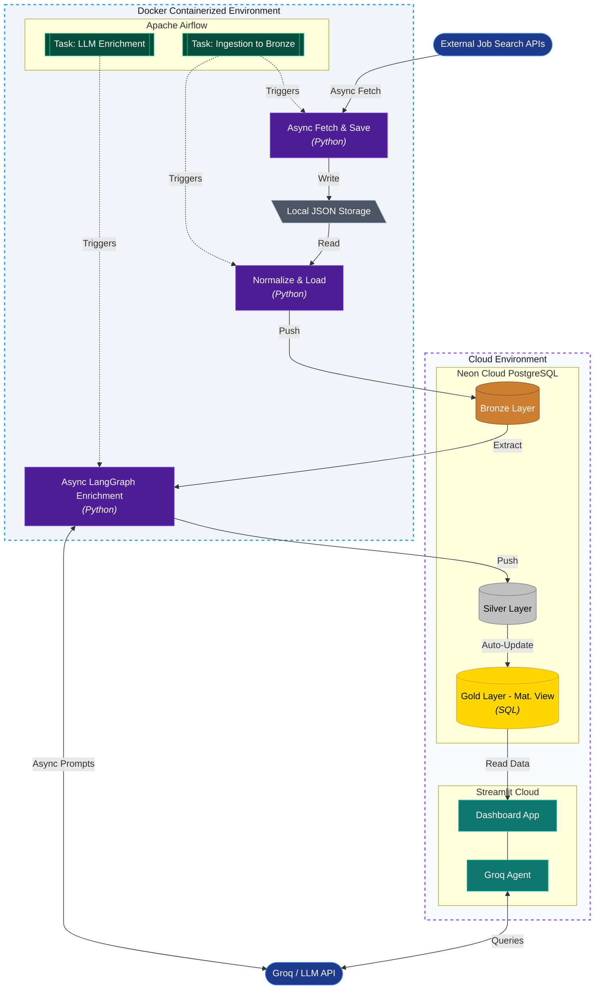

```mermaid
graph TB
    %% --- Entités Externes Haut ---
    ExtAPI([External Job Search APIs])
    GroqAPI([Groq / LLM API])

    %% --- Environnement Local Docker ---
    subgraph Docker [Docker Containerized Environment]
        direction TB
        
        subgraph Airflow [Apache Airflow]
            direction LR
            TaskIngest[[Task: Ingestion to Bronze]]
            TaskEnrich[[Task: LLM Enrichment]]
        end

        Fetch["Async Fetch & Save<br/><i>(Python)</i>"]
        LocalJSON[\Local JSON Storage\]
        Norm["Normalize & Load<br/><i>(Python)</i>"]
        LangGraph["Async LangGraph Enrichment<br/><i>(Python)</i>"]

        %% Orchestration locale
        TaskIngest -.->|Triggers| Fetch
        TaskIngest -.->|Triggers| Norm
        TaskEnrich -.->|Triggers| LangGraph

        %% Flux local
        Fetch -->|Write| LocalJSON
        LocalJSON -->|Read| Norm
    end

    %% --- Environnement Cloud ---
    subgraph Cloud [Cloud Environment]
        direction TB
        
        subgraph DB [Neon Cloud PostgreSQL]
            direction TB
            Bronze[(Bronze Layer)]
            Silver[(Silver Layer)]
            Gold[("Gold Layer - Mat. View<br/><i>(SQL)</i>")]
        end

        subgraph Streamlit [Streamlit Cloud]
            direction LR
            Dashboard[Dashboard App]
            Agent[Groq Agent]
        end
    end

    %% --- FLUX DE DONNÉES GLOBAUX ---
    %% 1. Ingestion depuis le haut
    ExtAPI -->|Async Fetch| Fetch
    Norm -->|Push| Bronze

    %% 2. Boucle d'enrichissement
    Bronze -->|Extract| LangGraph
    LangGraph <-->|Async Prompts| GroqAPI
    LangGraph -->|Push| Silver

    %% 3. Transformation interne BDD
    Silver -->|Auto-Update| Gold

    %% 4. Consommation applicative
    Gold -->|Read Data| Dashboard
    Dashboard --- Agent
    Agent <-->|Queries| GroqAPI

    %% --- Styles ---
    classDef external fill:#1e3a8a,stroke:#3b82f6,color:#fff;
    classDef python fill:#4c1d95,stroke:#8b5cf6,color:#fff;
    classDef storage fill:#4b5563,stroke:#9ca3af,color:#fff;
    classDef airflow_task fill:#064e3b,stroke:#10b981,color:#fff;
    classDef cloud_app fill:#0f766e,stroke:#14b8a6,color:#fff;
    classDef docker_env fill:#f1f5f9,stroke:#0ea5e9,stroke-width:2px,stroke-dasharray: 5 5,color:#0f172a;
    classDef cloud_env fill:#f8fafc,stroke:#8b5cf6,stroke-width:2px,stroke-dasharray: 5 5,color:#0f172a;

    %% Couleurs spécifiques pour les couches Medallion
    classDef bronze fill:#cd7f32,stroke:#8b5a2b,color:#fff;
    classDef silver fill:#c0c0c0,stroke:#808080,color:#000;
    classDef gold fill:#ffd700,stroke:#daa520,color:#000;

    class ExtAPI,GroqAPI external;
    class Fetch,Norm,LangGraph python;
    class LocalJSON storage;
    class TaskIngest,TaskEnrich airflow_task;
    class Dashboard,Agent cloud_app;
    class Docker docker_env;
    class Cloud cloud_env;
    
    %% Application des couleurs métalliques
    class Bronze bronze;
    class Silver silver;
    class Gold gold;
```