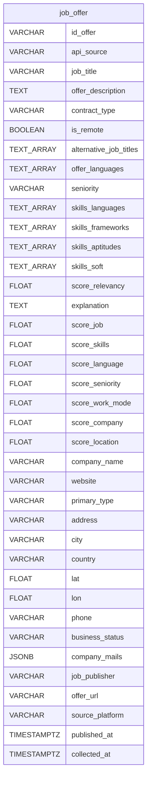

# Schema Serving

```mermaid
erDiagram
    job_offer {
        %% Identité de l'offre
        VARCHAR id_offer
        VARCHAR api_source
        VARCHAR job_title
        TEXT offer_description
        VARCHAR contract_type
        BOOLEAN is_remote

        %% Requirement
        TEXT_ARRAY alternative_job_titles
        TEXT_ARRAY offer_languages
        VARCHAR seniority
        TEXT_ARRAY skills_languages
        TEXT_ARRAY skills_frameworks
        TEXT_ARRAY skills_aptitudes
        TEXT_ARRAY skills_soft

        %% Scoring
        FLOAT score_relevancy
        TEXT explanation
        FLOAT score_job
        FLOAT score_skills
        FLOAT score_language
        FLOAT score_seniority
        FLOAT score_work_mode
        FLOAT score_company
        FLOAT score_location

        %% Company
        VARCHAR company_name
        VARCHAR website
        VARCHAR primary_type
        VARCHAR address
        VARCHAR city
        VARCHAR country
        FLOAT lat
        FLOAT lon
        VARCHAR phone
        VARCHAR business_status

        %% JSONB - contains a list of {email, confidence, explanation}
        JSONB company_mails

        %% Meta data
        VARCHAR job_publisher
        VARCHAR offer_url
        VARCHAR source_platform
        TIMESTAMPTZ published_at
        TIMESTAMPTZ collected_at
    }
```
