# Silver Enrichment — Nodes

| Graph | Node | Input | Output | Tools | Why |
| --- | --- | --- | --- | --- | --- |
| 1A | `route_to_extract_company` | `company_name` | — | — |  |
| 1B | `extract_company` | `job_title`, `offer_description` | `company_name` | LLM | The name of the company can be included in the job description but not in the company offer description. |
| 1C | `verify_company` | `company_name`, `job_title`, `offer_description` | `company_name` | — | Verify the LLM isn't hallucinating with a fuzzy match check. |
| 1D | `route_company_to_end` | `company_name` | — | — |  |
| 1E | `extract_location` | `job_title`, `offer_description`, `location_raw`, `city`, `country` | `location_raw` | LLM | Enriches the raw location with hints from the title/description (e.g. city in parentheses) before querying the geolocation API. Falls back to the original `location_raw` if nothing is found. |
| 2E | `extract_attributes` | `job_title`, `offer_description` | `seniority`, `is_remote`, `contract_type`, `offer_language` | LLM | Is included in the description or the title. |
| 1F | `find_location` | `company_name`, `location_raw`, `city` | `address`, `city`, `country`, `lat`, `lon`, `phone`, `business_status`, `company_website` | Google Maps Places API | Use the enriched location_raw, present 100% in a sample of 860 offers. |
| 1G | `find_mails` | `company_name`, `city`, `country` | `contacts` | LLM, DuckDuckGo (DDGS) | APIs are too limited for my budget or many APIs should have been setup. |
| 3E | `extract_skills` | `job_title`, `offer_description` | `skills_languages`, `skills_framework`, `skills_aptitudes`, `skills_soft` | LLM | Present in human language. |
| 2F | `determine_relevancy` | `job_title`, `offer_language`, `seniority`, `is_remote`, `contract_type`, `city`, `country`, `company_name`, `skills_languages`, `skills_framework`, `skills_aptitudes`, `skills_soft` | `score_skills`, `score_language`, `score_seniority`, `score_work_mode`, `score_company`, `score_location`, `explanation`, `prompt_relevancy` | LLM | The LLM attributes a grade matching the offer with a personalized profile describing the compatibility and the needs of the user. The LLM returns an explanation in human language. |
| 2G | `calculate_relevancy` | `score_skills`, `score_language`, `score_seniority`, `score_work_mode`, `score_company`, `score_location` | `score_relevancy` | — | Weighted function to calculate a final value depending on the different scores given by the AI. |

# Silver Enrichment — Graph  

```mermaid
flowchart LR
    classDef company fill:#1e3a5f,stroke:#3b82f6,color:#fff
    classDef attributes fill:#3f2e5f,stroke:#a855f7,color:#fff
    classDef location fill:#1f4d3d,stroke:#22c55e,color:#fff
    classDef skills fill:#5f3a1e,stroke:#f97316,color:#fff
    classDef scoring fill:#5f1e2e,stroke:#ef4444,color:#fff
    classDef terminal fill:#111827,stroke:#9ca3af,color:#fff

    START:::terminal --> 1A_route_to_extract_company

    subgraph Company["Company"]
        1A_route_to_extract_company:::company -- "No company: Company can be extracted" --> 1B_extract_company:::company
        1B_extract_company["🤖 1B_extract_company"]:::company --> 1C_verify_company:::company
        1C_verify_company --> 1D_route_company_to_end:::company
    end

    %% Application du style en pointillés sur les nodes "route" %%
    style 1A_route_to_extract_company stroke-dasharray: 5 5
    style 1D_route_company_to_end stroke-dasharray: 5 5

    subgraph Attributes["Attributs offer"]
        2E_extract_attributes["🤖 2E_extract_attributes"]:::attributes
    end

    subgraph Location["Localisation & Contacts"]
        1E_extract_location["🤖 1E_extract_location"]:::location --> 1F_find_location["🌐 1F_find_location"]:::location
        1F_find_location --> 1G_find_mails["🤖🤖🌐 1G_find_mails"]:::location
    end

    subgraph Skills["Skills"]
        3E_extract_skills["🤖 3E_extract_skills"]:::skills
    end

    subgraph Scoring["Scoring"]
        2F_determine_relevancy["🤖 2F_determine_relevancy"]:::scoring --> 2G_calculate_relevancy:::scoring
    end

    1E_extract_location ~~~ 2F_determine_relevancy
    


    1D_route_company_to_end -- "No company: offer cannot be processed" --> END

    1D_route_company_to_end --> junction((" "))
    junction --> 1E_extract_location
    junction --> 2E_extract_attributes
    junction --> 3E_extract_skills
    classDef dot fill:#9ca3af,stroke:#9ca3af,stroke-width:0
    class junction dot
    style junction width:8px,height:8px

    1A_route_to_extract_company --> junction((" "))



    2E_extract_attributes --> 2F_determine_relevancy
    3E_extract_skills --> 2F_determine_relevancy
    1F_find_location --> 2F_determine_relevancy

    1G_find_mails --> END:::terminal
    2G_calculate_relevancy --> END
```

